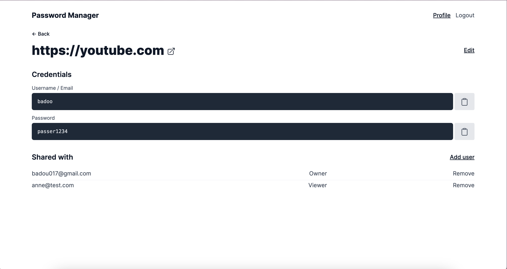

# Password Manager App

## Overview

Password Manager App is a secure and efficient tool designed to help users manage their passwords and share them with other users based on roles and permissions. Built with Ruby on Rails 7 and PostgreSQL, it leverages Devise for authentication.

## Features

- Secure password storage
- Role-based access control
- Share passwords with other users
- User authentication with Devise
- User-friendly interface

## Requirements

- Ruby 3.2.2
- Rails 7.0.5 or higher
- PostgreSQL 13 or higher
- Node.js and Yarn

## Installation

1. **Clone the repository**

    ```bash
    git clone git@github.com:Badara-Senpai/password_manager.git
    cd password-manager
    ```

2. **Install dependencies**

    ```bash
    bundle install
    ```

3. **Setup the database**

    ```bash
    rails db:create
    rails db:migrate
    ```

4. **Start the server**

    ```bash
    rails server
    ```

Visit `http://localhost:3000` in your browser to see the application.

## Usage

1. **Sign up for an account** - Register as a new user.
2. **Log in** - Use your credentials to log in.
3. **Manage passwords** - Add, update, or delete your passwords.
4. **Share passwords** - Share your passwords with other users, specifying their roles and permissions.




## Development

To contribute to the development of this app, follow these steps:

1. **Fork the repository**
2. **Create a new branch**

    ```bash
    git checkout -b feature/your-feature-name
    ```

3. **Make your changes and commit them**

    ```bash
    git add .
    git commit -m "Add some feature"
    ```

4. **Push to the branch**

    ```bash
    git push origin feature/your-feature-name
    ```

5. **Create a pull request** - Describe your changes and submit for review.

## Contact

If you have any questions or suggestions, feel free to open an issue or contact me at badara.samb@outlook.com.
